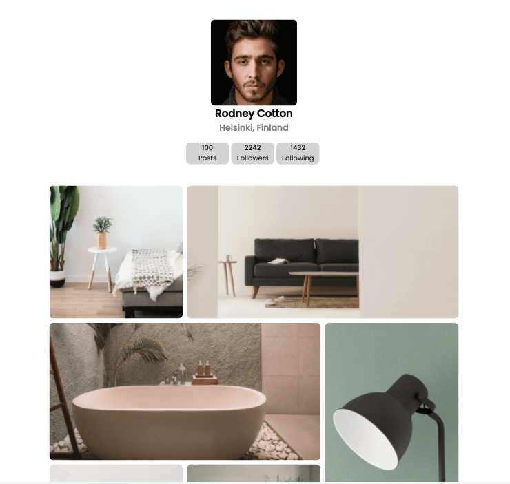

<h1 align="center">My Gallery</h1>

   Solution for a challenge from  <a href="http://devchallenges.io" target="_blank">Devchallenges.io</a>.

  <h3>
    <a href="https://jdegand.github.io/my-gallery">
      Live Link
    </a>
     | 
    <a href="https://web.archive.org/web/20240526045248/https://legacy.devchallenges.io/challenges/gcbWLxG6wdennelX7b8I">
      Challenge
    </a>
  </h3>

## Table of Contents

- [Overview](#overview)
  - [Built With](#built-with)
- [Features](#features)
- [Useful Resources](#useful-resources)

## Overview

***

***

Note: Design concept has accessibility contrast problems.  

### Built With

- HTML
- CSS

## Features

This application/site was created as a submission to a [DevChallenges](https://devchallenges.io/challenges) challenge. The [challenge](https://web.archive.org/web/20240526045248/https://legacy.devchallenges.io/challenges/gcbWLxG6wdennelX7b8I) was to build an application to complete the given user stories. **Note**: The previous design document may be incomplete, as you need to find an archived version of the challenge as all `legacy` challenges have had their documentation removed from DevChallenges.

## Useful Resources

- [Steps to replicate a design with only HTML and CSS](https://devchallenges-blogs.web.app/how-to-replicate-design/)
- [Blog](https://www.benmeadowcroft.com/webdev/articles/definition-lists/) - definition lists
